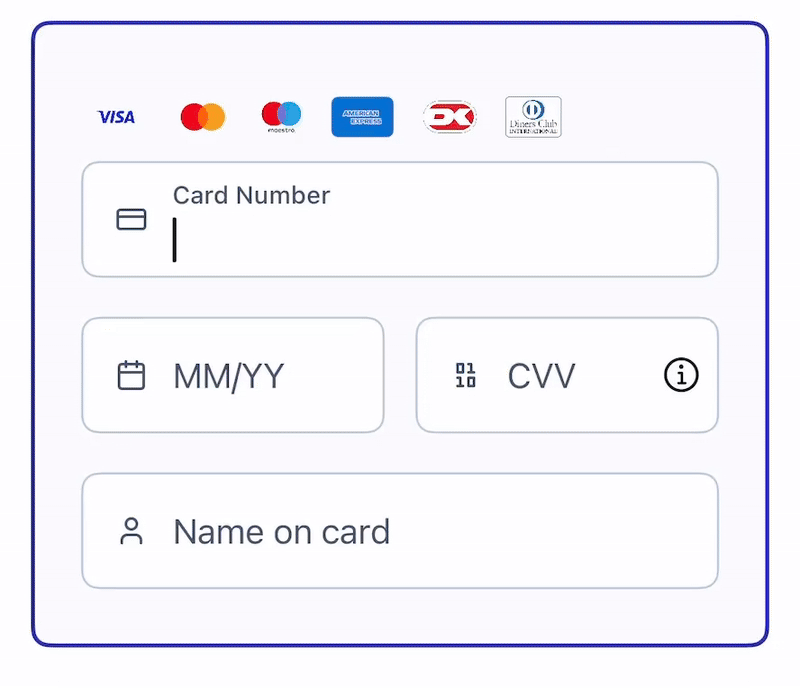
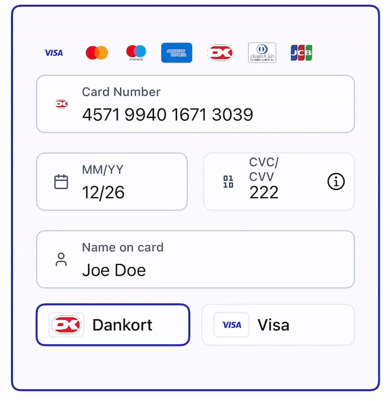

TODO insert badges

# Nexi Paygate iOS SDK

## Table of Contents

1. [What is Nexi Paygate iOS SDK](#what-is-nexi-paygate-ios-sdk)
2. [Technical Overview](#technical-overview)
3. [Supported Payment Methods](#supported-payment-methods)
   - [Card Payments](#card-payments)
     - [3D Secure](#3d-secure)
   - [Digital Wallets](#digital-wallets)
4. [Installation](#installation)
   - [Swift Package Manager](#swift-package-manager)
   - [CocoaPods](#cocoapods)
   - [Carthage](#carthage)
5. [Backend Setup & Mobile Flow](#backend-setup--mobile-flow)
   - [Flow Diagram (High-Level)](#flow-diagram-high-level)
   - [What the Backend Must Do (Back End → Back End)](#what-the-backend-must-do-back-end--back-end)
   - [What the Mobile App Must Do (Front End)](#what-the-mobile-app-must-do-front-end)
6. [Integration Guidelines](#integration-guidelines)  
   - [Common Integration Steps (For All Payment Methods)](#common-integration-steps-for-all-payment-methods)  
   - [Card Payments](#card-payments)
     - [Card Entry UI Setup](#card-entry-ui-setup)  
       - [CardPayment Object](#cardpayment-object)  
       - [Card Details Entry View](#card-details-entry-view)
     - [Using the SDK in a UIKit Application](#using-the-sdk-in-a-uikit-application)
     - [Implementation Example](#implementation-example)
     - [Advanced Flow](#advanced-flow)  
     - [UI Customization](#ui-customization)  
     - [Co-badged Cards Support](#co-badged-cards-support)
   - [Apple Pay](#apple-pay)
     - [Setup and Configuration](#setup-and-configuration)
       - [Implementation Example](#implementation-example)
7. [Handling Results and Errors](#handling-results-and-errors)
8. [Testing](#testing)
9. [FAQ](#faq)
10. [Resources and Contacts](#resources-and-contacts)

---

## What is Nexi Paygate iOS SDK
Nexi Paygate SDK is a native library that allows merchants to integrate secure and seamless payment processing into their iOS applications.  
It simplifies PCI DSS compliance, reduces integration complexity, and supports multiple payment methods. Merchants can process payments directly within their app, providing a smooth checkout experience for their customers.

**Key benefits**
- Reduces the PCI compliance burden by encapsulating card data handling.
- Provides a native, consistent checkout experience for iOS users.
- Delivers native in-app EMV 3-D Secure support to reduce fraud and boost authorisation rates.
- Supports credential-on-file (tokenisation), subscription, and recurring payments, depending on the merchant configuration.
- Offers customizable UI and theming for consistent app branding and improved conversion.

---

## Technical Overview
The SDK provides a set of Swift types and views to collect card data, validate it, and hand over a payment request payload directly to the Nexi Paygate REST API. The SDK is designed for SwiftUI but is usable from UIKit as well.

**Minimum requirements**
- iOS 15.0 or later
- Xcode 14.0 or later
- Swift 5.7 or later

---
## Supported Payment Methods

### Card Payments
Supported schemes:
- Visa
- Mastercard
- American Express
- Diners
- Discover
- JCB
- Maestro

#### 3D Secure
The SDK integrates EMV 3-D Secure flows natively, supporting both frictionless authentication and challenge scenarios.

### Digital Wallets
- Apple Pay

---

## Installation
You can add the SDK to your project using your preferred dependency manager - [Swift Package Manager](https://swift.org/package-manager/), [CocoaPods](http://cocoapods.org), or [Carthage](https://github.com/Carthage/Carthage), ensuring easy setup and updates.

### Swift Package Manager
To integrate the SDK using Swift Package Manager, follow these steps:

1. Open your project in Xcode.
2. Select **File > Add Packages...**
3. Enter the repository URL for Nexi Paygate iOS SDK: `https://github.com/netsconnect/Computop-iOS`.
4. Choose the version or branch you want to use.
5. Select **Add Package**.

See Apple's guide: https://developer.apple.com/documentation/xcode/adding_package_dependencies_to_your_app

### CocoaPods
- Verify that CocoaPods is installed, and if it isn’t, install it by running:
```
sudo gem install cocoapods
```
Add the SDK to your Podfile:
```ruby
platform :ios, '15.0'
use_frameworks!

target 'YourAppTarget' do
  pod 'ComputopSDK'
end
```
Install the dependencies in your project:
```bash
pod install
```

### Carthage

- Verify that Carthage is installed, and if it isn’t, install it by running:
```
brew install carthage
```

- Add the SDK to your Cartfile:
```ruby
github "your-repository/ComputopSDK" ~> 1.0
```

- Install the dependencies in your project:
```bash
carthage update --use-xcframeworks
```

- Drag the built .xcframework from the Carthage/Build folder into your Xcode project.

---

## Backend Setup & Mobile Flow

**Important:** The Nexi Paygate iOS SDK does **not** require any special client-side initialization with long-lived merchant credentials. Instead, sensitive operations (creating the payment intent and obtaining OAuth access tokens) must be performed on your backend (server-to-server). The mobile app receives short-lived tokens from the backend and uses them to confirm the payment via the SDK.

### Flow diagram (high-level)
```
Merchant Backend (BE) → Paygate Authentication (client credentials) → returns access_token
Merchant Backend (BE) → Create Payment Intent → returns payment_intent_id
Merchant Backend (BE) → Paygate Authentication (grant_type = payment_intents) → returns access_token
Mobile App ← payment_intent_id, access_token (from Merchant BE)
Mobile App (collect card data) → Nexi Paygate iOS SDK (confirm using payment_intent_id + access_token) → Paygate (confirm payment)
Nexi Paygate iOS SDK → Mobile App (ProcessResult: success / cancellation / failure)
```

### What the backend must do (Back End → Back End)

1. **[Create a Payment Intent](https://computop-docs.redocly.app/mobile-sdk/createpaymentintent)**
   - Call the **Nexi Paygate REST API** from your backend to create a **Payment Intent** suitable for mobile confirmation.  
   - Use **standard authentication** (client ID and client secret) with `grant_type` = `client_credentials` when accessing this endpoint.  
   - The backend will receive a `payment_intent_id` in the response.

2. **[Obtain an Access Token for completing the payment with the mobile client](https://computop-docs.redocly.app/authentication/authorizationservice)**  
   - Use your **standard credentials** (`client_id` / `client_secret`).  
   - Set the following parameters:  
     - `grant_type` = `payment_intents`  
     - `payment_intent_id` = value obtained after creating the Payment Intent (previous step)  
   - Request the access token from the appropriate endpoint:  
     - **Test:** `https://test.computop-paygate.com/authorization/oauth/token`  
     - **Production:** `https://www.computop-paygate.com/authorization/oauth/token`  
   - Return **only** the short-lived access token value to the mobile client.

> **Security note:** Never generate OAuth access tokens or call the Paygate unified endpoint using client secrets from the mobile app. Always perform these steps on the merchant backend to protect secrets and to comply with the best security practices.

### What the mobile app must do (Front End)

The mobile app's flow is a two-part process. First, it performs steps common to all payments (like getting credentials from your Back end). Second, it performs steps that are specific to the payment method the user has selected.

---

## Integration guidelines

### Common integration steps (For all payment methods)

No matter what payment method is used, the mobile app must always:

1. Receive Credentials from the Backend:
    - payment_intent_id
    - access_token (short-lived OAuth token)

2. Handle the Final Result:
    - After the SDK is triggered, it will return a ProcessResult (.success, .cancellation, or .failure).
    - Your app is responsible for interpreting this result and showing the appropriate "success" or "failure" message             to the user (see Handling Results and Errors).

### Card Payments

This is the flow when the user chooses to pay with a new card.

1. **Collect card data**  
   - Use the SDK UI (`CmtCard.cardDetailsEntry(...)`) or your custom UI with the SDK’s validation helpers.

2. **Receive from the backend:**  
   - `payment_intent_id`  
   - `access_token` (short-lived OAuth token)

3. **Assemble a `PaymentRequestPayload`**  
   - Use the `AccessToken` enum (test/production) and the card payment model containing the `payment_intent_id` and payment data.

4. **Trigger the SDK to confirm the payment**  
   - Call the payment request receiver (`paymentRequestReceiver?.success(payload)`).  
   - The SDK will handle the confirmation with **Nexi Paygate Backend**, using the provided `payment_intent_id` and `access_token`.

5. **Handle the `ProcessResult`**  
   - The SDK returns the transaction result: `success`, `cancellation`, or `failure`.  
   - Card data is automatically cleared from the UI once the transaction completes.

#### Card Entry UI Setup

To handle card payments in your app, you need two components:
- A `CardPayment` object  
- The Card Details Entry view

##### CardPayment object

You can create an instance of `CardPayment` in two ways:
- **With default `MerchantPreferences`**:
```swift
var cardPayment = CmtCard.cardPayment()
```

- **With custom `MerchantPreferences`**:
```swift
var cardPayment = CmtCard.cardPayment(with: merchantPreferences)
```

##### Card Details Entry view

The SDK provides a `@ViewBuilder` function returning the Card Details View. Example (SwiftUI):
```swift
CmtCard.cardDetailsEntry(
    for: cardPayment,
    shouldShowSaveCardToggle: payment.isTokenizationEnabled,
    onFormAction: { formAction in
        switch formAction {
        case .completion(isComplete: let isComplete):
            // Use this to enable/disable your Pay button
            break
        case .selection:
            // Handle selection changes if needed
            break
        }
    }
)
```

**Parameters**

- `cardPayment: Binding<CardPayment>` - binding to your `CardPayment` object  
- `shouldShowSaveCardToggle: Bool` - shows a toggle to save the user's card (for credential-on-file/tokenization) 
- `onFormAction: @escaping (FormEvent) -> Void` - closure triggered on selection or validation status changes; use it to control Pay button state or select payment methods  

**Fields & Validation**

The Card Details View contains four fields with separate validation rules:

- Card Number  
- Expiry Date  
- Secure Code (CVV)  
- Cardholder Name  

The user is automatically moved to the next field after entering correct information. The card scheme is detected dynamically during number entry.  



#### Using the SDK in a UIKit Application
TODO

#### Implementation Example

```swift
// 1) Backend returns these values to the mobile client after BE-to-BE calls:
let accessToken = AccessToken.test(value: "<ACCESS_TOKEN_FROM_BACKEND>")
let paymentModel = CardPaymentModel(paymentIntentId: "<PAYMENT_INTENT_ID_FROM_BACKEND>", /* other fields */)

// 2) Build the payment request payload
let cardRequestPayload = PaymentRequestPayload(
    accessToken: accessToken,
    cardPaymentModel: paymentModel
)

// 3) Obtain the payment request receiver
let paymentRequestReceiver = cardPayment.obtainPaymentRequestReceiver()

// 4) Confirm the payment by invoking the success callback with the payload
Task {
    let result = await paymentRequestReceiver?.success(cardRequestPayload)
    
    // Handle result (success, cancellation, or failure)
}
```

#### Advanced Flow

Advanced scenarios include:

- **Enabling tokenization (save-card toggle)** and handling credential-on-file post-processing. See the [Nexi Paygate credential-on-file documentation](https://developer.computop.com/display/DE/credentialOnFile) for merchant-side token usage and lifecycle.  
- **Observe `CardPayment.status`** to drive UI state (for example, enable/disable the Pay button based on form completeness or network state).  
- **Integrate with your backend** to process MIT (Merchant-Initiated Transaction) payments directly via Paygate (server-side).

#### UI Customization

The card entry view supports **dark** and **light** modes by default. You can localize language resources or provide a custom implementation of `CardViewLanguage` if needed.

##### Language

**Supported languages**
- English
- Danish
- Finnish
- Norwegian
- Swedish
- German
- Automatic (detects system locale when available)

```swift
// Set a built-in language
CmtCard.language = DefaultCardViewLanguage.english

// Or provide a custom implementation conforming to CardViewLanguage:
CmtCard.cardViewLanguage = MyCustomCardViewLanguage()
```
> Tip: prefer `cardViewLanguage` for complete control over localized strings; use `language` for quick built-in selections.

#### Co-badged cards support

When a co‑branded card (Visa/Dankort) is detected, an additional picker appears in the card entry UI allowing the user to select the desired scheme.



---

### Apple Pay 

The SDK simplifies the integration of Apple Pay for in-app payments, reducing the complexity of handling the payment flow.

For a complete guide, please refer to the official documentation: https://developer.computop.com/display/EN/Apple+Pay

#### Setup and Configuration
Before you can use Apple Pay in your app, you must complete a one-time setup process.

1. Create an Apple Merchant ID: In your Apple Developer account, create a new Merchant Identifier.

2. Contact Helpdesk for CSR: Contact the Computop Helpdesk with your new Apple Merchant ID. They will generate and provide you with a Certificate Signing Request (CSR) file.

3. Create Payment Processing Certificate: In your Apple Developer account, use the CSR file from the Helpdesk to generate a Payment Processing Certificate. Download this certificate.

4. Enable Apple Pay in Xcode: In your project's "Signing & Capabilities" tab, add the "Apple Pay" capability and select the Merchant ID you created.

#### Implementation Example
Once your configuration is complete, you can integrate the Apple Pay flow using the SDK.

##### Initialize the SDK

TODO

##### Trigger the Payment

TODO

---

## Handling Results and Errors

The SDK returns a `ProcessResult` when a payment completes. Card details in the Card Details View are cleared once the transaction finishes.

```swift
public enum ProcessResult: Equatable {
    case success(PaymentDataCard)
    case cancellation(PaymentDataCard)
    case failure(CardProcessError)
}
```

`CardProcessError` (possible views):
```swift
case threeDsInitializationFailed
case invalidResponse
case requestFailed(Error)
case computopBadRequest([ComputopBadRequestError])
case computopUnprocessableEntity(ComputopUnprocessableEntity)
case internalServerError(ComputopInternalError)
case threeDsChallengeRuntimeError
case threeDsChallengeFlowFailed
```

**Details for notable cases**

- `.computopBadRequest(ComputopBadRequestError)` - the request contained invalid parameters.
   Each `ComputopBadRequestError` includes:
   - `field`: the request field that caused the error (helps locate the problem).
   - `error`: a human-readable description of the issue for that field.
- `.computopUnprocessableEntity(ComputopUnprocessableEntity)` - the server understood the request but could not process it (business-rule or validation constraint). The object typically contains:
    - `description`: why the entity could not be processed.
    - `code`: an internal error code useful for logging and support.
    - `paymentIntentId`: the identifier of the related payment intent (for correlation and investigation).
- `requestFailed(Error)` - a transport or networking-level error. Treat as transient unless the underlying error indicates otherwise.
- `threeDsInitializationFailed`, `threeDsChallengeRuntimeError`, `threeDsChallengeFlowFailed` - errors related to the EMV 3-D Secure / challenge flow. These require special attention (see notes below).

See Nexi Paygate error codes for the full list and detailed definitions: https://developer.computop.com/display/EN/A4+Error+codes

### Example: handling `ProcessResult`

```swift
if let result = await paymentRequestReceiver?.success(cardRequestPayload) {
    switch result {
    case .success(let paymentData):
        // Payment succeeded - update UI and notify backend
    case .cancellation(let paymentData):
        // User cancelled - reset UI or prompt accordingly
    case .failure(let error):
        // Map CardProcessError to a user-friendly message and log details
        handleCardProcessError(error)
    }
}
```


**Best practices for error handling**
- **Show user-friendly messages.** Never display raw error objects to end users. Map technical errors to short, actionable messages.  
- **Log full error details server-side** (error objects, `code`, `paymentIntentId`, stack/underlying `Error`) for diagnostics and support.  
- **Map field errors to inputs.** For `.computopBadRequest`, surface the `field`/`error` next to the corresponding input field to guide the user.  
- **Retry transient errors.** Apply exponential backoff for network-related `requestFailed(Error)` errors.  
- **Distinguish client vs server issues.** For `500` / `internalServerError`, escalate to backend/support with `paymentIntentId`.  
- **Treat 3DS errors carefully.** Challenge-flow failures may need retries, alternate flows, or merchant-side investigation (BankID / 3DS provider).  
- **Avoid sensitive logging on client.** Never persist full card data or tokens in logs; store only identifiers (e.g., `paymentIntentId`) and non-sensitive error details.

---

## Testing
Use `AccessToken.test(value:)` to indicate Test environment in the `PaymentRequestPayload`:

```swift
public enum AccessToken {
    case production(value: String)
    case test(value: String)
}
```

**Test card numbers** (Test Environment):
- **MasterCard** - PAN: `5424180000000171` - Scenario: AUTHENTICATED_APPLICATION_FRICTIONLESS
- **MasterCard** - PAN: `5424180011113336` - Scenario: AUTHENTICATED_APPLICATION_CHALLENGE
- **VISA** - PAN: `4005571702222222` - Scenario: AUTHENTICATED_APPLICATION_FRICTIONLESS
- **VISA** - PAN: `4571994016713039` - Scenario: AUTHENTICATED_APPLICATION_CHALLENGE

---

## FAQ
**Q: Does the SDK support tokenization (credential-on-file)?**  
A: Yes - the SDK supports displaying a save-card toggle and obtaining tokenization data. Actual COF/token lifecycle (storage, reuse) is handled by merchant/backend using Nexi Paygate token APIs.

**Q: Which payment methods are supported?**  
A: Card payments and Apple Pay

**Q: How do I handle validation and enable the action button (Pay, Subscribe, etc.)?**  
A: Observe `onFormAction` events from `CmtCard.cardDetailsEntry` or inspect `CardPayment.status` (use `.canSubmit` as a helper).

**Q: Where do I get API credentials and test tokens?**  
A: Credentials (merchantId, API key) and test tokens are provided by Nexi. Contact helpdesk@computop.com for access to a test account.

---

## Resources and Contacts
- Developer portal: https://developer.computop.com/
- REST API Reference: https://computop-docs.redocly.app/
- Support / Helpdesk: [helpdesk@computop.com](mailto:helpdesk@computop.com)  

---

## Changelog
### Release of Nexi iOS SDK v1.0.0
- Card payments
- Apple Pay
- Native in-app EMV 3-D Secure
- Credential-on-file / tokenisation
- Composable SwiftUI card payment widget
